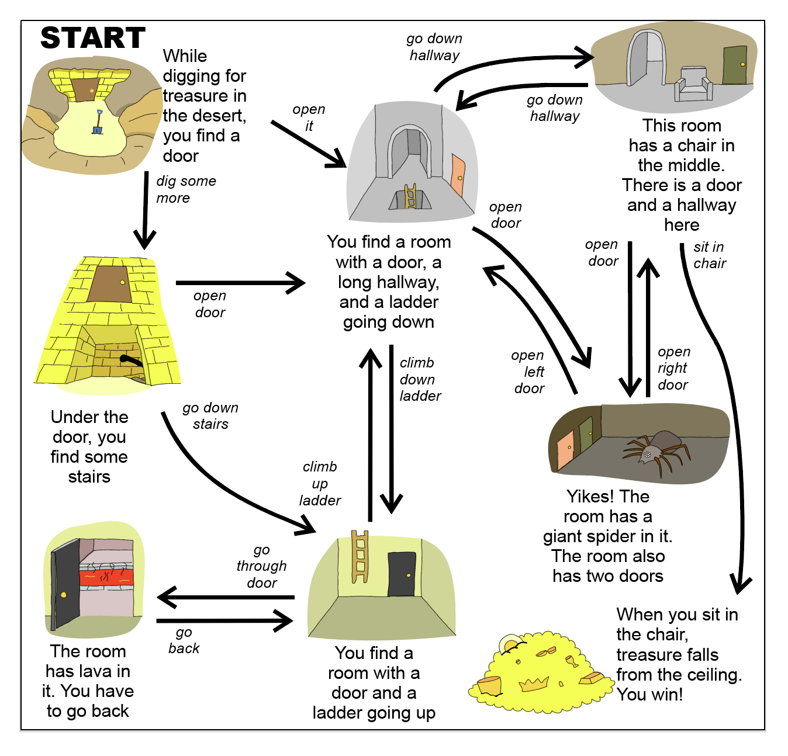
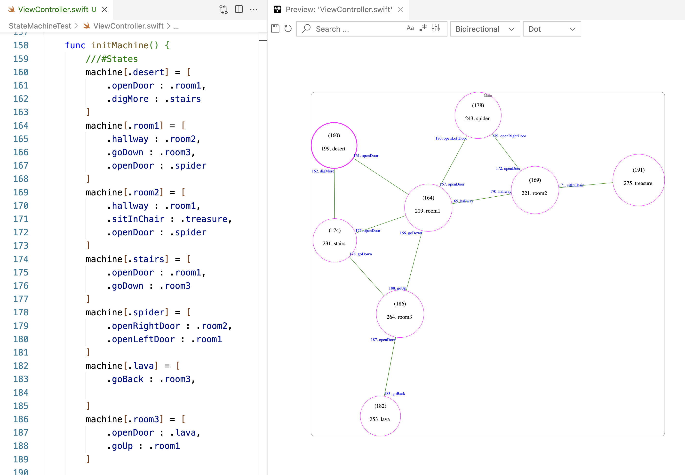

# StateMachineTest

A game scene flow like this:



Can be described by a Finite State Machine as a set of states and messages between them:



In the Swift code, each state is represented by a key in a dictionary.
Another sub-dictionary describes the next state given a specific message.

```
///#States
    machine[.desert] = [
        .openDoor : .room1,
        .digMore : .stairs
    ]
    machine[.room1] = [
        .hallway : .room2,
        .goDown : .room3,
        .openDoor : .spider
    ]
    machine[.room2] = [
        .hallway : .room1,
        .sitInChair : .treasure,
        .openDoor : .spider
    ]
    machine[.stairs] = [
        .openDoor : .room1,
        .goDown : .room3
    ]
    machine[.spider] = [
        .openRightDoor : .room2,
        .openLeftDoor : .room1
    ]
    machine[.lava] = [
        .goBack : .room3,
        
    ]
    machine[.room3] = [
        .openDoor : .lava,
        .goUp : .room1
    ]

    machine[.treasure] = [
        :
    ]
///#EndStates
```

The state diagram is synced with the Swift source code thanks to this [VS Code Extension](https://marketplace.visualstudio.com/items?itemName=huse360.fsm-swift-preview)